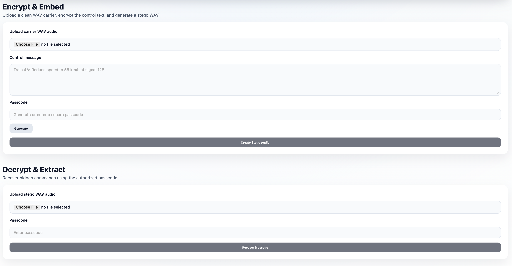

# RailSecure: Secure Audio Steganography System

## Overview
In modern railway and mobile communication systems, sensitive operational messages—such as train control instructions, emergency alerts, and signaling updates—require high security. While encryption protects content, the mere presence of encrypted transmissions can attract interception or jamming attempts.

**RailSecure** addresses this by using **Audio Steganography** to hide encrypted control messages inside routine audio signals (like voice announcements). This ensures data remains confidential, covert, and tamper-resistant without degrading the audio quality noticeably.

## Key Features
- **Secure Encryption**: Messages are encrypted using AES-128 (via Fernet) with a key derived from a user-provided passcode using PBKDF2HMAC (SHA-256).
- **LSB Steganography**: Encrypted data is embedded into the Least Significant Bits of the audio carrier (WAV format), ensuring the audio sounds unchanged to the human ear.
- **Passcode Protection**: Only authorized receivers with the correct passcode can extract and decrypt the message.
- **Full-Stack Web Interface**: A modern, aesthetic React frontend for easy file upload, encryption, and decryption.

## Tech Stack

### Frontend
- **React.js**: UI Component library.
- **Vite**: Fast build tool and development server.
- **CSS3**: Custom aesthetic styling with responsive design.

### Backend
- **Python 3.x**: Core logic.
- **FastAPI**: High-performance API framework.
- **Cryptography**: `cryptography` library for Fernet (AES) and PBKDF2.
- **Wave**: Standard library for processing WAV audio files.

## Implementation Details

### Encryption Process
1.  **Key Derivation**: A random 16-byte salt is generated. The user's passcode is combined with this salt using PBKDF2HMAC (390,000 iterations) to derive a secure 32-byte key.
2.  **Encryption**: The message is encrypted using Fernet (AES-128 in CBC mode with PKCS7 padding and HMAC authentication).
3.  **Payload Construction**: The payload consists of a Magic Header (`STEG`), the Salt, and the Encrypted Token.

### Embedding (LSB)
1.  The audio file is read as a sequence of bytes.
2.  The payload length is prefixed to the data.
3.  The payload bytes are converted to bits.
4.  These bits replace the least significant bit of consecutive audio byte samples. This modifies the amplitude slightly, but is imperceptible to humans.

### Extraction
1.  The system reads the LSBs of the audio file to recover the length prefix and then the payload.
2.  The salt is extracted from the payload to regenerate the decryption key from the passcode.
3.  The token is decrypted. If the passcode is wrong or data is tampered with, decryption fails.

## How to Run

### Prerequisites
- Node.js & npm
- Python 3.8+

### 1. Backend Setup
Navigate to the backend directory:
```bash
cd backend
```

Install dependencies:
```bash
pip install -r requirements.txt
```

Run the server:
```bash
# Make sure you are in the backend directory
python -m uvicorn app.app:app --host 0.0.0.0 --port 8000 --reload
```
The API will start at `http://localhost:8000`.

### 2. Frontend Setup
Open a new terminal and navigate to the frontend directory:
```bash
cd frontend
```

Install dependencies:
```bash
npm install
```

Start the development server:
```bash
npm run dev
```
Open the application in your browser at `http://localhost:5173` (or the port shown in the terminal).

## Project Structure
```
Stego/
├── backend/             # FastAPI Server
│   ├── app/
│   │   └── app.py       # Main application logic
│   └── requirements.txt # Python dependencies
├── frontend/            # React + Vite Application
│   ├── public/
│   ├── src/
│   │   ├── App.jsx      # Main React Component
│   │   ├── App.css      # Styling
│   │   └── ...
│   ├── index.html
│   └── package.json
└── screenshots/         # Images of the application
```

## Screenshots


 

